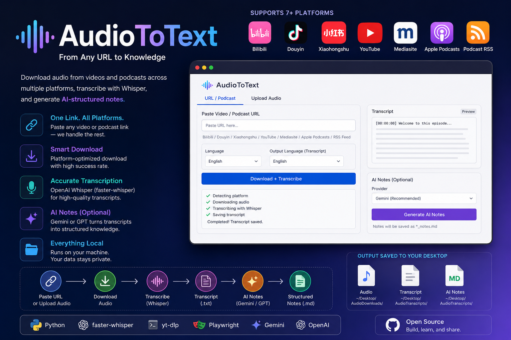

# AudioToText

A local Gradio tool that downloads video audio from multiple platforms, transcribes it using faster-whisper, and optionally generates AI-structured Markdown notes.

Paste a video or podcast URL — the tool detects the platform, downloads audio, transcribes it, and saves the transcript to your Desktop. Then optionally click **Generate AI Notes** to turn the raw transcript into structured knowledge.



## Supported Platforms

| Platform | URL Patterns |
| -------- | ------------ |
| Bilibili | `bilibili.com/video/...` `b23.tv/...` |
| Douyin | `v.douyin.com/...` (share text supported) |
| Xiaohongshu | `xiaohongshu.com/explore/...` `xiaohongshu.com/discovery/...` `xhslink.com/...` |
| YouTube | `youtube.com/watch?v=...` `youtu.be/...` |
| Mediasite | `mediasite.*.ac.uk/...` |
| Apple Podcasts | `podcasts.apple.com/...` episode or show URLs |
| Podcast RSS | `feeds.*` `rss.*` podcast RSS feeds |

Share text from Douyin and Xiaohongshu is supported — paste the full share message and the URL is extracted automatically.

## Project Structure

```text
├── app.py                  # Gradio web UI entry point
├── core/                   # Business logic package
│   ├── config.py           # Directory config and env loading
│   ├── platform_detect.py  # URL extraction and platform detection
│   ├── downloader.py       # Audio download router (yt-dlp)
│   ├── podcast.py          # Apple Podcasts / RSS feed resolver and downloader
│   ├── douyin.py           # Douyin headless browser download
│   ├── xiaohongshu.py      # Xiaohongshu headless browser download
│   ├── transcriber.py      # Whisper transcription and transcript saving
│   └── ai_notes.py         # AI notes generator (Gemini / GPT)
├── scripts/
│   └── StartTranscriber.command  # macOS double-click launcher
├── docs/                   # Product requirement documents
├── .env.example            # API key configuration template
└── requirements.txt
```

## Installation

Requires Python 3.10+, ffmpeg, and the conda `Tools` environment (or any env with the dependencies below).

```bash
pip install -r requirements.txt
python -m playwright install chromium
brew install ffmpeg
```

### AI Notes Setup

Copy `.env.example` to `.env` and fill in your API keys:

```bash
cp .env.example .env
```

```text
GEMINI_API_KEY=your-gemini-key
OPENAI_API_KEY=your-openai-key
```

Only the provider you select needs a key configured.

## Usage

```bash
python app.py
```

The Gradio interface opens in your browser at `http://127.0.0.1:7860`.

On macOS, you can also double-click `scripts/StartTranscriber.command` to launch directly.

**URL tab** — paste a supported URL (or share text), select language, click Download + Transcribe.

**Upload Audio tab** — upload a local `.mp3` / `.wav` / `.m4a` / `.mp4` / `.aac` file for transcription.

**Generate AI Notes** — after transcription, select an AI provider (Gemini / GPT) and click the button. Notes are saved as `*_notes.md` alongside the transcript.

## Output

| Type | Location |
| ---- | -------- |
| Audio | `~/Desktop/AudioDownloads/` |
| Transcripts | `~/Desktop/AudioTranscripts/*.txt` |
| AI Notes | `~/Desktop/AudioTranscripts/*_notes.md` |

Files are named after the video title when available, otherwise `Platform_YYYYMMDD_HHMMSS`.

## Platform Notes

- **Douyin / Xiaohongshu** use headless Chromium (Playwright) to bypass bot detection. No login required for public content.
- **Bilibili / YouTube / Mediasite** use yt-dlp with Chrome cookies. Sign in to the site in Chrome first for login-restricted videos.
- **Apple Podcasts / Podcast RSS** resolve the podcast RSS feed, extract the episode audio enclosure, and convert it to MP3 with ffmpeg.
- Audio longer than 30 minutes is split into smaller MP3 chunks for transcription, then merged back into one transcript.
- Transcription runs on CPU (`int8`) by default. For GPU, change `device="cpu"` to `device="cuda"` in `core/transcriber.py`.
- AI Notes uses Gemini by default. Long transcripts are automatically chunked and merged.
